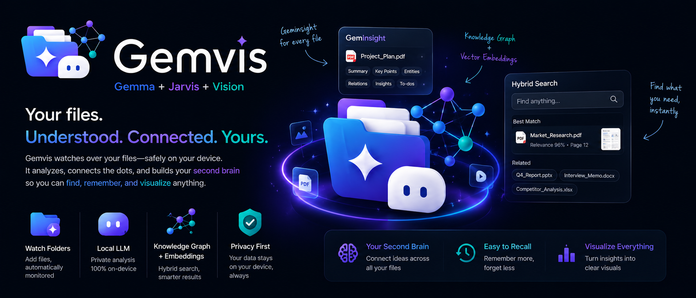
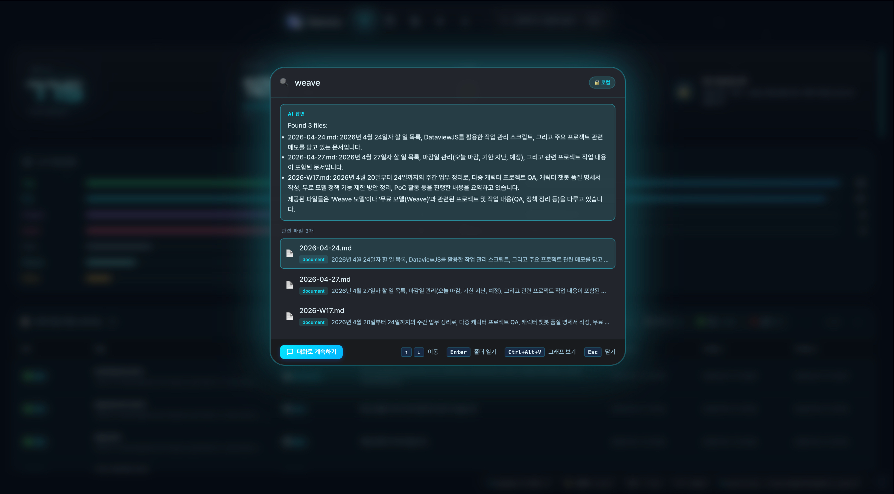
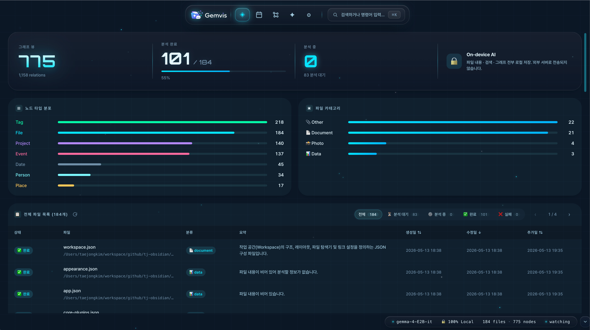
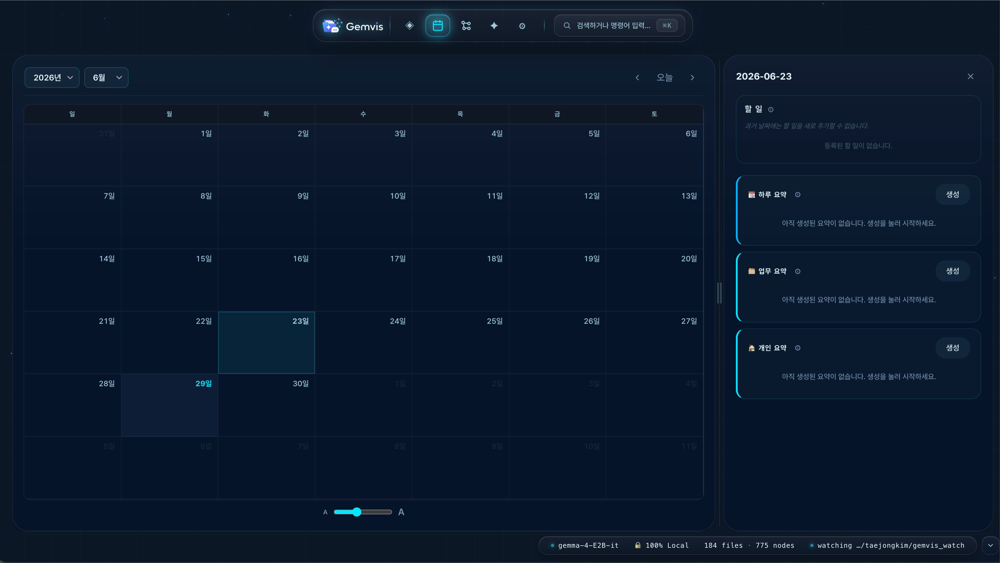
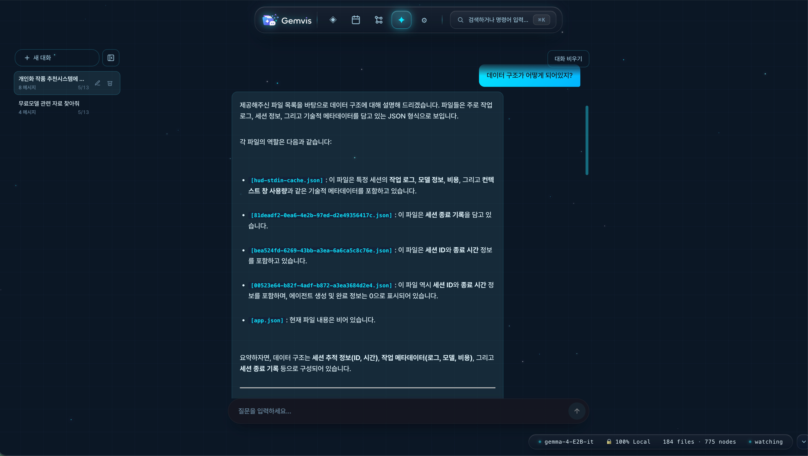

# Gemvis

<div align="center">

**프라이버시 우선 온디바이스 개인 지식그래프 비서**

*클라우드에 단 한 바이트도 보내지 않고, 혼란스러운 파일 시스템을 지능적이고 검색 가능한 지식그래프로 변환합니다.*




</div>

---

## 문제 정의

> *"AI가 발전하면서 우리가 처리해야 하는 정보는 기하급수적으로 증가하고 있습니다. 그러나 인간의 인지 능력은 변하지 않았습니다. 우리가 정보를 잃는 이유는 저장을 못해서가 아니라, 너무 많이 저장해서 다시는 찾지 못하기 때문입니다."*

근로자의 **22.5%가 정보 과부하를 1위 스트레스 요인으로 꼽습니다** *(Meyer et al., 2021)*. 평균적으로 한 사람이 이미 가지고 있는 파일을 찾는 데 **주당 2시간**을 소비합니다.

기존 솔루션은 모두 어딘가를 희생합니다:

| 솔루션 | 프라이버시 | AI 지능 | 자동화 | 오프라인 |
|--------|:---------:|:-------:|:------:|:--------:|
| 클라우드 AI (ChatGPT, Notion AI) | ❌ | ✅ | ✅ | ❌ |
| 로컬 파일 관리 (Finder, Everything) | ✅ | ❌ | ❌ | ✅ |
| 노트 앱 (Obsidian, Roam) | ✅ | ❌ | ❌ | ✅ |
| 온디바이스 AI (Siri, Google) | ✅ | ⚠️ | ⚠️ | ✅ |
| **Gemvis** | ✅ | ✅ | ✅ | ✅ |

**왜 이제야 가능한가?** 기존 온디바이스 모델(~4B 파라미터)은 파일에서 구조화된 관계를 정확하게 추출할 추론 능력이 부족했습니다. **Gemma 4 E2B-it (~2 GB)가 그 한계를 바꿨습니다** — 노트북에서 실행 가능할 만큼 작으면서도 실질적인 지식 추출이 가능한 최초의 모델입니다.

---

## 솔루션

**Gemvis** (**Gem**ma + Jar**vis** + Vi**sion**)는 프라이버시 우선 온디바이스 개인 지식그래프 비서입니다.

폴더를 지정하면, 모든 파일을 자동으로 읽고 구조화된 지식(사람, 장소, 프로젝트, 이벤트, 날짜, 태그)을 추출해 관계 그래프로 연결하고, 자연어로 검색할 수 있게 합니다 — 전부 로컬에서, 전부 오프라인으로, 구독료 없이.

```
사용자:  "지난달 김과장이랑 간 식당 어디였어?"

Gemvis: "2026-03-15에 홍대 스시 오마카세였습니다.
         관련 파일: meeting_notes.pdf · IMG_1234.jpg · voice_memo.m4a"
         [그래프 강조: 김과장 → 회의 → 식당 → 파일들]
```

클라우드 없음. 데이터는 절대 내 기기를 벗어나지 않습니다.

---

## 주요 기능

### 스포트라이트 검색 — `Ctrl+K`
전역 오버레이에서 자연어 질의를 입력하면 AI 생성 답변과 함께 순위가 매겨진 파일 결과를 반환합니다. 결과에서 `Enter`를 누르면 OS 파일 관리자에서 해당 폴더를 열고, `Ctrl+Alt+V`를 누르면 지식그래프에서 해당 노드로 이동하며, **"대화에서 계속"** 버튼을 클릭하면 컨텍스트를 대화 검색 탭으로 이전해 후속 질문을 이어갈 수 있습니다.



### 지식그래프 뷰
7가지 노드 타입(**파일, 사람, 장소, 프로젝트, 이벤트, 날짜, 태그**)이 있는 인터랙티브 Force-Directed 그래프입니다. `Ctrl+Alt+V`로 진입하면 대상 노드와 1-hop 이웃이 강조되고 자동 줌됩니다. 줌, 드래그, 노드 타입 필터링 지원. **← 검색** 버튼으로 상태를 유지한 채 스포트라이트로 돌아올 수 있습니다.


### 대시보드
**4단계 분석 배지**가 있는 실시간 페이지네이션 파일 목록:
`⏳ 대기 → ⚙️ 분석 중 → ✅ 완료 / ❌ 실패`

파일은 감지되는 즉시 목록에 등장하며(Gemma 4 분석 전에도), UI가 절대 블로킹되지 않습니다. 생성일, 수정일, 발견일 기준 정렬 지원. 카테고리·상태 분포 차트가 실시간 업데이트됩니다.



### 캘린더
설정한 업무 시간 스케줄에 따라 **업무**와 **개인** 시간대로 분리된 AI 일별 활동 요약을 제공합니다. Gemma 4가 자연어로 요약을 작성하고 로컬에 저장합니다. FullCalendar 기반 월간 뷰와 날짜별 상세 패널을 제공합니다.



### 대화 검색
세션 기록이 유지되는 풀 채팅 인터페이스입니다. 3-엔진 하이브리드 검색(SPARQL + 임베딩 + LLM 의도 파싱)이 Gemma 4에 풍부한 컨텍스트를 제공해 이전 답변을 참조하는 다중 턴 대화가 가능합니다. 토글 가능한 디버그 패널에서 의도 파싱 원본 출력과 그래프 쿼리 결과를 확인할 수 있습니다.



---

## 아키텍처

### GemInsight — 단일 진실 공급원 (SSoT)

모든 파일은 정확히 하나의 **GemInsight** 레코드를 생성합니다 — 앱의 모든 기능을 위한 마스터 JSON 객체입니다.

```json
{
  "file_path": "/Users/username/gemvis_watch/meeting.md",
  "category": "document",
  "summary": "Gemvis 해커톤 진행 상황 회의",
  "tags": ["회의록", "해커톤", "Gemvis"],
  "entities": {
    "people": ["김철수", "이영희"],
    "projects": ["Gemvis"],
    "dates": ["2026-05-11"]
  },
  "relations": [
    {"source": "김철수", "target": "Gemvis", "relation": "works_on"}
  ],
  "analysis_status": "completed"
}
```

이 레코드는 RDF 그래프 노드의 `raw_insight` 속성으로 완전히 저장됩니다. 다른 모든 저장소(엔티티/관계 인덱스, 임베딩, 이벤트 로그)는 언제든 재생성 가능한 **파생 인덱스**입니다 — v1에서 데이터를 무음으로 손실시켰던 단편화 문제를 근본적으로 해결했습니다.

### 4단계 분석 파이프라인 (상태 머신)

```
[파일 발견]
       │
       ▼  Stage 1 — 즉시, 논블로킹
  ┌─────────┐                         ┌─────────────┐
  │  대기   │ ──── 스켈레톤 생성 ────▶│   분석 중   │
  └─────────┘      LLM 큐 등록         └─────────────┘
       ▲                                      │ Gemma 4
       │ 파일 수정 → 롤백                      ▼
       │                              ┌───────────┐   ┌────────┐
       └──────────────────────────────│   완료    │   │  실패  │
                                      └───────────┘   └────────┘

  [앱 재시작 시: "분석 중" 노드 → 전부 "대기"로 롤백 (크래시 복구)]
```

2단계 파이프라인이 UI 반응성을 유지합니다. 파일은 감지되는 순간 `⏳ 대기` 상태로 대시보드에 나타나고, Gemma 4가 백그라운드에서 작업하면서 상태가 전이됩니다. 서버가 분석 도중 크래시되더라도 시작 시 롤백이 자동으로 파일을 복구해 수동 개입 없이 재분석이 시작됩니다.

### 3-엔진 하이브리드 검색

```
사용자 질의: "지난주 LLM 관련 회의"
                    │
                    ▼
        1. 의도 파싱 (Gemma 4)
           search_terms: ["LLM", "2026-06-22"]
           semantic_query: "회의 토론 AI"
                    │
         ┌──────────┴──────────┐
         ▼                     ▼
  2. SPARQL (구조적)      3. 임베딩 (의미적)
     정확/부분 문자열        코사인 유사도
     엔티티 확장             384차원 다국어
     → 20~50개 후보          → 상위 N개 재순위
         │                     │
         └──────────┬──────────┘
                    ▼
         4. LLM 답변 생성 (Gemma 4)
            "이번 주 LLM 관련 회의 3건이 있었습니다..."
```

| 엔진 | 역할 | 강점 |
|------|------|------|
| SPARQL (rdflib) | 구조적 골격 | 고유명사, 정확한 날짜, 카테고리 필터 |
| sentence-transformers | 의미적 살 | 주제, 동의어, 맞춤법 오류 |
| Gemma 4 | 의도 파싱 + 답변 합성 | 자연어 입출력 |

### 저장소 구조

| 저장소 | 형식 | 경로 | 역할 |
|--------|------|------|------|
| 지식그래프 | RDF/Turtle | `~/.gemvis/graph.ttl` | 기본 저장소 (GemInsight SSoT + 엔티티 인덱스) |
| 임베딩 | NumPy `.npz` | `~/.gemvis/embeddings.npz` | 의미 검색용 384차원 벡터 |
| 이벤트 로그 | RDF/Turtle | `~/.gemvis/events.ttl` | 생성/수정/삭제 타임라인 (캘린더용) |

---

## 기술적 도전과 해결

**v1의 무음 데이터 손실 근본 해결.**
기존 아키텍처는 분석 결과를 쓰기 시점에 세 저장소로 분리하고 원본 JSON을 폐기했습니다. 어느 저장소에서든 읽기 오류가 발생하면 데이터는 영구 손실되었고 복구 경로가 없었습니다. `raw_insight` 속성을 RDF 노드의 단일 정규 레코드로 도입해, 모든 파생 저장소(엔티티 인덱스, 임베딩, 이벤트)를 하나의 원본에서 재생성할 수 있도록 설계했습니다.

**크래시 안전 상태 머신과 시작 시 자동 복구.**
백엔드 프로세스가 Gemma 4 분석 도중 종료되면 파일이 `분석 중` 상태에 영구적으로 고착됩니다. 서버 시작 라이프사이클에 고아 `분석 중` 노드를 스캔해 `대기`로 롤백하는 로직을 추가해, 수동 개입 없이 클린 복구가 보장됩니다.

**자동화 테스트로 무음 프로덕션 버그 포착.**
QA 과정에서 `_node_to_insight()` 폴백 경로(v2 이전 노드 처리용)가 `analysis_status`를 무조건 기본값 `"pending"`으로 덮어쓰는 버그를 발견했습니다. 이로 인해 `failed` 노드가 재시도 필터 실행 전에 잘못 분류되어, `POST /api/files/retry-failed`가 항상 `count: 0`을 반환했습니다. 테스트 없이 출시했다면 "실패 파일 재시도" 버튼이 조용히 아무것도 하지 않는 채로 배포됐을 것입니다.

**테스트 33/33 통과. TypeScript strict 모드 클린. 프로덕션 빌드: 809 kB → 252 kB (gzip).**

---

## 기술 스택

### 백엔드
| | 기술 |
|-|------|
| 웹 프레임워크 | FastAPI + uvicorn |
| 지식그래프 | rdflib (RDF/Turtle) + SPARQL |
| 임베딩 | `sentence-transformers/paraphrase-multilingual-MiniLM-L12-v2` (384차원, 다국어) |
| LLM 클라이언트 | OpenAI SDK → 로컬 llama-server (OpenAI 호환) |
| 파일 감시 | watchdog |
| PDF 추출 | pypdf |

### 프론트엔드
| | 기술 |
|-|------|
| 프레임워크 | Vite + React 19 + TypeScript (strict) |
| 그래프 시각화 | react-force-graph-2d |
| 캘린더 | FullCalendar |
| 마크다운 렌더링 | react-markdown |

### AI 모델
- **Gemma 4 E2B-it Q4_K_M** — ~2 GB GGUF, llama.cpp로 서빙
- 멀티모달: 텍스트, PDF, 이미지 (base64 비전 API)
- Tool Calling / Function Calling으로 구조화된 JSON 출력 보장
- GPU 사용 가능 시 GPU (`-ngl 999`), 자동 CPU 폴백

---

## 지원 파일 형식

| 카테고리 | 확장자 | 처리 방식 |
|---------|-------|----------|
| 텍스트 | `.txt` `.md` `.csv` `.json` `.log` | LLM에 직접 전송 (최대 10,000자) |
| 이미지 | `.png` `.jpg` `.jpeg` `.gif` `.webp` `.bmp` | Base64 → 멀티모달 LLM |
| 문서 | `.pdf` | pypdf로 텍스트 추출 → LLM |

---

## 성능 목표

| 작업 | CPU | GPU |
|------|-----|-----|
| 파일 분석 (Gemma 4) | < 30초 | < 10초 |
| 자연어 검색 | < 2초 | < 2초 |
| 그래프 렌더링 | < 500ms | < 500ms |

---

## 지원 운영체제

| OS | 상태 | 비고 |
|----|------|------|
| Windows 10/11 | ✅ | 기본 타겟 |
| macOS | ✅ | Finder 연동 (`open -R`) |
| Linux | ✅ | `xdg-open` |
| WSL2 | ✅ | `\\wsl.localhost\<distro>\…` UNC 경로 |

---

## 빠른 시작

### macOS / Linux / WSL
```bash
./scripts/setup_mac.sh    # 최초 1회: 의존성 + llama.cpp + 모델 다운로드 + 프론트엔드 빌드
./scripts/start_mac.sh    # 백엔드 + LLM 서버 시작 → http://localhost:8000
```

### Windows
`scripts\setup_windows.bat` 더블클릭 → `scripts\start_windows.bat` 더블클릭

### 수동 설치
```bash
cp .env.example .env
python3.11 -m venv venv && source venv/bin/activate
pip install -r requirements.txt
cd frontend && npm install && npm run build && cd ..
python run.py    # → http://localhost:8000
```

> **Python 3.11 필수.** Python 3.13/3.14는 pyparsing 멀티스레드 경쟁 조건으로 SPARQL 쿼리가 깨집니다.

---

## 프로젝트 구조

```
gemvis/
  api.py              # FastAPI 서버 + 시작 라이프사이클 (크래시 복구)
  insight.py          # GemInsight 데이터클래스 + Gemma 4 tool calling
  knowledge_graph.py  # rdflib KG + SPARQL + 4단계 상태 머신 메서드
  embeddings.py       # sentence-transformer 벡터 저장소
  watcher.py          # watchdog 파일 감시 + 2단계 hydration 큐
  search.py           # 3-엔진 하이브리드 검색 파이프라인
  llm_client.py       # OpenAI 호환 LLM 클라이언트 래퍼
  config.py           # 환경변수 기반 설정

frontend/src/
  App.tsx             # 라우팅 + 사이드바 + 전역 키보드 단축키
  Spotlight.tsx       # Ctrl+K 오버레이 검색 UI
  pages/
    Dashboard.tsx     # 4단계 파일 목록 + 통계 + 차트
    GraphView.tsx     # Force-directed KG 뷰어 (포커스 모드)
    Search.tsx        # 대화형 RAG 채팅 UI
    Calendar.tsx      # 일별 활동 요약 (FullCalendar)
    Settings.tsx      # 감시 폴더 + 업무 스케줄 + LLM 파라미터

scripts/
  setup_mac.sh / setup_windows.bat    # 원클릭 설치
  start_mac.sh / start_windows.bat    # 원클릭 실행
  stop_mac.sh                         # 모든 프로세스 종료
```

---

## 개발자

개인 프로젝트 — 기획, 설계, 백엔드/프론트엔드 구현, 문서 작성 전 과정을 혼자 진행했습니다.

| | |
|--|--|
| **GitHub** | [@taejongK](https://github.com/taejongK) |
| **Email** | xowhddk123@gmail.com |

---

## 로드맵

| 단계 | 일정 | 범위 |
|------|------|------|
| **MVP** (현재) | 5주차 | 텍스트 + PDF + 이미지 · KG · 하이브리드 검색 · 5개 뷰 |
| **Phase 2** | 3개월 내 | `risk_level` UI · 파일 상세 모달 · 모바일 (Gemma 4 E4B) |
| **Phase 3** | 6개월 내 | 멀티기기 E2E 암호화 동기화 · 플러그인 시스템 |

---

## 학술적 근거

1. Meyer, J. et al. (2021). 근로자의 22.5%가 정보 과부하를 최대 스트레스 요인으로 꼽음. *Frontiers in Psychology.*
2. Ahmad, F. et al. (2023). 인지 과부하 → 불안 → 회피 행동. *Information Processing & Management.* [doi:10.1016/j.ipm.2023.103194](https://doi.org/10.1016/j.ipm.2023.103194)
3. Floridi, L. (2015). "연산력의 문제가 아닌 두뇌력의 문제다." *The Ethics of Information.* Oxford University Press.
4. Ragnedda, M. (2017). 정보 리터러시 격차가 디지털 불평등을 심화시킨다. *The Third Digital Divide.* Routledge.

---

## 개발 참고

```bash
# 테스트 실행
python -m pytest tests/test_v2_hydration.py --noconftest -v   # 33/33

# 프론트엔드 타입 체크 + 빌드
cd frontend && npx tsc --noEmit && npm run build

# 로그 모니터링
tail -f .gemvis/backend.log .gemvis/llama-server.log

# API 문서 (자동 생성)
open http://localhost:8000/docs     # Swagger UI
open http://localhost:8000/redoc    # ReDoc

# 데이터 초기화
./scripts/stop_mac.sh && rm -rf ~/.gemvis/ && ./scripts/start_mac.sh
```

전체 API 명세: [API_CONTRACT.md](API_CONTRACT.md)
아키텍처 상세: [docs/ARCHITECTURE_V2.md](docs/ARCHITECTURE_V2.md)
수동 QA 체크리스트: [docs/QA_MANUAL_CHECKLIST.md](docs/QA_MANUAL_CHECKLIST.md)

---

## 라이선스

TBD
